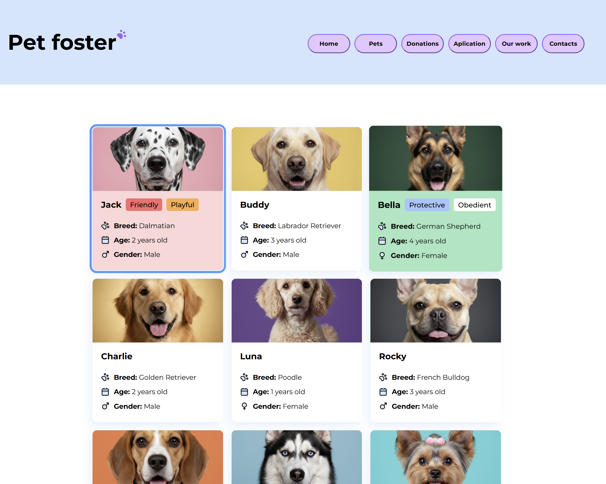

# 🐶 Pet Foster

Welcome to **Pet Foster** — an accessibility-focused website where users can explore and express interest in adoptable dogs.  
This project emphasizes **web accessibility**, ensuring everyone can interact with the site using **screen readers, keyboards, and assistive technologies**.

Check it live on [Netlify](https://pet-foster.netlify.app/cards.html).

---

## 🔗 Demo

Check out the project live: [Pet Foster on Netlify](https://pet-foster.netlify.app/cards.html)

---

## 📸 Screenshot



_(Move your screenshot to `images/Screenshot.png` in your repository.)_

---

## 🚀 Features

- 🐕 **Browse dog cards** with detailed information
- ♿ **Accessibility-focused design** — semantic HTML, ARIA roles, proper tab order, and focus indicators
- ⌨️ **Full keyboard navigation** — Tab, Enter, Space, and Arrow Keys supported
- 🖼️ **Accessible images** — decorative images ignored by screen readers, informative images with descriptive alt text
- 📝 **Express interest form** — submit your favorite dogs with multiple-choice questions and instant feedback
- 🌈 **Color contrast & readability** — WCAG AA compliant, text legible for all users
- 📱 **Responsive layout** — works on desktop, tablet, and mobile

---

## 📦 File Structure

```
📂 css/ # Stylesheets
📂 img/ # Dog images and icons
📂 js/ # JavaScript logic
cards.html # Dog cards page
index.html # Homepage
```

---

## 🧠 How It Works

1. Users can **browse cards of dogs** available for fostering.
2. The **form** allows expressing interest in a dog with multiple-choice questions.
3. **Instant feedback** is provided via ARIA live regions without page reloads.
4. All interactive elements are **fully keyboard-accessible**, with clear focus indicators.
5. Semantic HTML, ARIA roles, and proper `fieldset`/`legend` are used for **screen reader compatibility**.
6. Color contrast and font sizes meet **WCAG AA standards** for readability.

---

## 🎯 Accessibility Principles Applied

- ✅ Semantic HTML (`<header>`, `<nav>`, `<fieldset>`, `<legend>`, `<main>`)
- ✅ Keyboard navigation (Tab, Enter, Spacebar, Arrow Keys)
- ✅ Screen reader-friendly (ARIA roles, labels, live regions)
- ✅ Color contrast & readability compliance (WCAG AA)
- ✅ Responsive layout for desktop, tablet, and mobile

---

## ❗ Important

- This project demonstrates **inclusive design** practices and helps users experience the web like people using assistive technologies.
- Focus on **keyboard navigation, proper labeling, and accessible forms**.

---

## 📄 License

This project is free for educational use.
